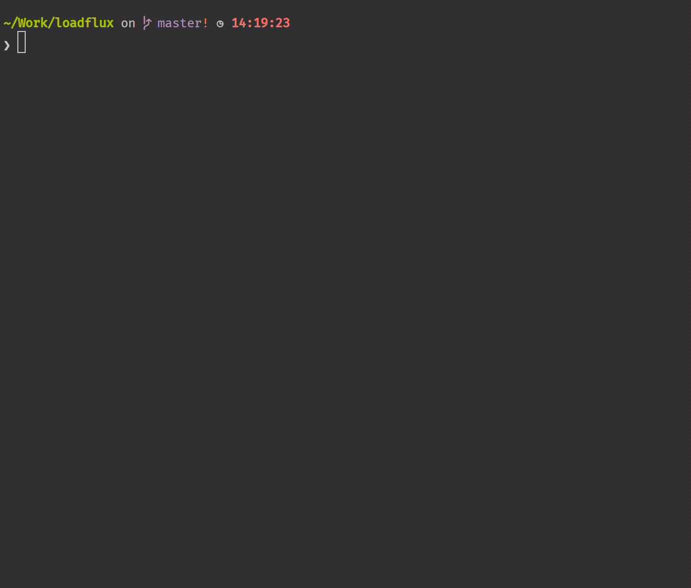

# LOADFLUX

## What is it?

Loadflux is a simplistic tool for load testing.
You just need to focus more on how to design your scenario, and the scripting is just taking several minutes.
The infrastructure requirement is pretty low, you can simulate hundreds of virtual users to send requests to your application.
It support different strategy to ramp the load, by default in this library, we provide:

- sustain a constant load, for example, you want to keep 200 users in your web application to do different actions. 
When one user exits, another user will be arriving to sustain the load
- ramp up the load until you know the extrame capability of your infrastructure and user experience, for example, 
you can ramp up 50 new users per second, then sometime your application will crash and have no response.

## Roadmap

- collect statistical data to help analytics and build metrics to visualise
- real-time charts and 360° view of virtual users activities
- complex load phases: multiple phases for different load strategy and duration
- [`loadflux recorder`](https://github.com/StuffNZ/loadflux-recorder) Chrome extension to record the scenario and generate scenario file automatically 
- distributed load testing

## Story behind it

The original intention is we have to develop an ad-hoc solution for our cases of load testing. We evaluated different load 
testing tools: 
- [`Cypress`](https://github.com/StuffNZ/stuff-composer-load-test): generate load with e2e testing and run in a browser for each virtual user, but it's slow and prone to crash sometimes
- [`Artillery`](https://github.com/StuffNZ/stuff-composer-load-test-artillery): ramp up users per second, but not support the case - sustain a constant load
- `K6`: customised runtime, not compatible with existing nodejs modules and 3rd-party library

